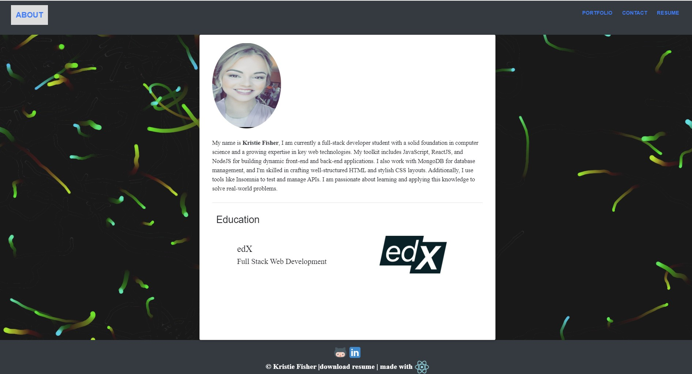

# react-portfolio

## User Story
AS AN employer looking for candidates with experience building single-page applications
I WANT to view a potential employee's deployed React portfolio of work samples
SO THAT I can assess whether they're a good candidate for an open position

## Acceptance Criteria
GIVEN a single-page application portfolio for a web developer
WHEN I load the portfolio
THEN I am presented with a page containing a header, a section for content, and a footer
WHEN I view the header
THEN I am presented with the developer's name and navigation with titles corresponding to different sections of the portfolio
WHEN I view the navigation titles
THEN I am presented with the titles About Me, Portfolio, Contact, and Resume, and the title corresponding to the current section is highlighted
WHEN I click on a navigation title
THEN I am presented with the corresponding section below the navigation without the page reloading and that title is highlighted
WHEN I load the portfolio the first time
THEN the About Me title and section are selected by default
WHEN I am presented with the About Me section
THEN I see a recent photo or avatar of the developer and a short bio about them
WHEN I am presented with the Portfolio section
THEN I see titled images of six of the developer’s applications with links to both the deployed applications and the corresponding GitHub repository
WHEN I am presented with the Contact section
THEN I see a contact form with fields for a name, an email address, and a message
WHEN I move my cursor out of one of the form fields without entering text
THEN I receive a notification that this field is required
WHEN I enter text into the email address field
THEN I receive a notification if I have entered an invalid email address
WHEN I am presented with the Resume section
THEN I see a link to a downloadable resume and a list of the developer’s proficiencies
WHEN I view the footer
THEN I am presented with text or icon links to the developer’s GitHub and LinkedIn profiles, and their profile on a third platform (Stack Overflow, Twitter)
## Screenshot 


## Table of Contents

- [Introduction](#introduction)
- [Features](#features)
- [Installation](#installation)
- [Usage](#usage)
- [Technologies Used](#technologies-used)
- [License](#license)


## Introduction

This portfolio is designed to offer a comprehensive overview of my capabilities as a developer, including live demonstrations of my work, a downloadable resume, and direct ways to contact me.

## Features

- **About Me**: An introduction with my photo/avatar and a short bio.
- **Portfolio**: A selection of my projects, showcasing my work and skills.
- **Contact**: A form to contact me for opportunities and inquiries.
- **Resume**: Information about my professional background and a link to download my resume.

## Installation
To set up this project locally, follow these steps:

1. **Clone the repository**:
   ```bash
   git clone https://github.com/FisherK19/react-portfolio
   cd react-portfolio

2. Install dependencies: npm install

3. Run the application: npm start


## Technologies Used

- **React**: Used for building the user interface with functional components and hooks.
- **React Router**: Manages navigation between sections without reloading the page.
- **React Hook Form**: Provides efficient and easy form validation.
- **CSS/Sass**: For styling components.

## License

This project is licensed under the MIT License - see the [LICENSE.md](LICENSE) file for details.

## Deployed Link:
https://main--profound-marigold-1d491a.netlify.app/#/


